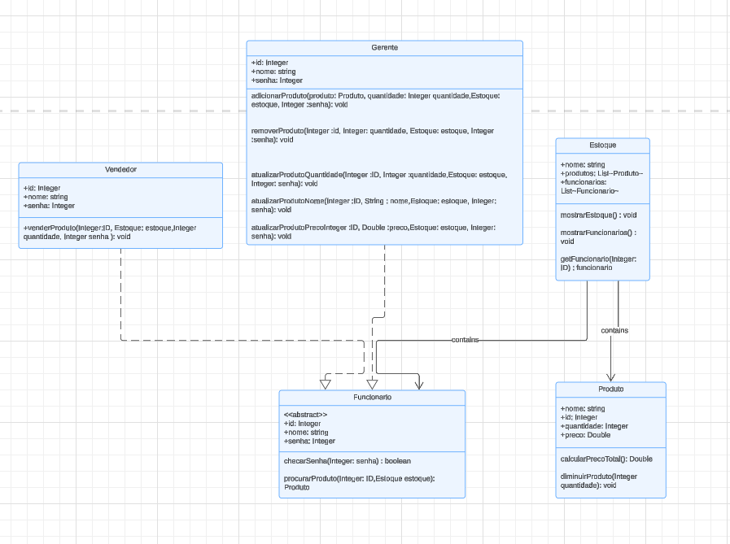

# Projeto estoque POO

* A ideia desse projeto é criar um estoque que possua uma lista de produtos e uma lista de funcionários. Esses produtos podem ser manipulados por um gerente e vendidos por funcionários vendedores. O gerente também pode contratar novos funcionários.

##  :pushpin: Diagramação UML

## Classes Base 

### Funcionário
  * Como é possível ver na imagem, a classe funcionário é uma classe *abstrata* que servirá para ter métodos e atributos comuns as classes Gerente e Vendedor.
    
-> O método checar senha serve para confimar que um determinado funcionário realmente está querendo executar aquela ação.

    
 -> O método procurar produto serve para buscar um produto na lista de produtos, podendo assim realizar a determinada operação sobre aquele produto.

    
    ~~~Java
              

    import models.entities.Estoque;
    import models.entities.Produto;
    
    public abstract class Funcionario {
    	private Integer ID;
    	private String nome;
    	private Integer senha;
    	
	public Funcionario(String nome, Integer senha) {
		this.nome = nome;
		this.senha = senha;
		ID = (int)(Math.random() * (1000 - 1 + 1)+1);
	}
	
	public Integer getID() {
		return ID;
	}
	public String getNome() {
		return nome;
	}
	
	public boolean checarSenha(Integer senha) {
		return !(senha == this.senha);
	}
	
	protected Produto procurarProduto(Integer ID, Estoque estoque) {
		for(Produto produto : estoque.getProdutos()) {
			if(produto.getID().equals(ID)) {
				return produto;
			}
		}
		return null;
	}

	@Override
	public String toString() {
		StringBuilder bg = new StringBuilder();
		bg.append("\n ID: ");
		bg.append(getID());
		bg.append("\n Nome: ");
		bg.append(getNome());
		
		return bg.toString();

	    }
    }
     ~~~

### :convenience_store: Produto 
* A classe produto não é *abstrata* mas é uma classe base que servirá para compor a lista de produtos que o estoque possui.
  
-> Ela possui os métodos calcularPreçoTotal e diminuirQuantidade que servem para que um vendedor realize determinada venda de um produto e quantidade seja diminuída do estoque.

      
  ~~~Java

        package models.entities;
  
        public class Produto {
        	private String nome;
        	private Integer ID;
        	private Integer quantidade;
        	private Double preco;
      	
      	public Produto(String nome,Integer quantidade, Double preco) {
      		this.nome = nome;
      		this.quantidade = quantidade;
      		this.preco = preco;
      		ID = (int)(Math.random() * (1000 -1 + 1) + 1);
      	}
      	
      	public String getNome() {
      		return nome;
      	}
      	protected void setQuantidade(Integer quantidade) {
      		this.quantidade = quantidade;
      	}
      	
      	protected void setPreco(Double preco) {
      		this.preco = preco;
      	}
      	
      	protected void setNome(String nome) {
      		this.nome = nome;
      	}
      	public Integer getID() {
      		return ID;
      	}
      	
      	public Integer getQuantidade() {
      		return quantidade;
      	}
      	
      	public Double getPreco() {
      		return preco;
      	}
      	
      	public Double calcularPrecoTotal() {
      		return preco * quantidade;
      	}
      	
      	public void DiminuirProduto(Integer quantidade) {
      		this.quantidade -= quantidade;
      	}
      	
      	public boolean equals(Integer ID) {
      		if(ID == this.ID) {
      			return true;
      		}
      		return false;
      	}
      	
      	@Override
      	public String toString() {
      		StringBuilder bg = new StringBuilder();
      		bg.append(" ID: ");
      		bg.append(getID());
      		bg.append("\n Nome: ");
      		bg.append(getNome());
      		bg.append("\n Preço: ");
      		bg.append(String.format("%.2f", getPreco()));
      		bg.append("\n Quantidade: ");
      		bg.append(getQuantidade());
      		return bg.toString();
      	}
      	
      	
          }

  ~~~

## Classes Principais

### :clipboard: Gerente
  * A classe gerente é uma sub classe da classe funcionário e tem como objetivo manipular a lista de produtos e funcionários. Podendo adicionar ou remover produtos e alterar atributo de produtos específicos, ela também pode adicionar novos funcionários a lista de funcionários.
  
 -> Os métodoss atualizarProdutoQuantidade, atualizarProdutoPreco e atualizarProdutoNome permitem que o gerente muda o valor dos atributos de um produto específico passando seu ID

  
-> Os métodos adicionarProduto e removerProduto podem adicionar e remover um produto da lista de protudos

  
-> O método contratarFuncionario pode adicionar um novo funcionário a lista de funcionários do estoque

  
  ~~~Java

            package models.entities;

    import model.exceptions.RedundanciaException;
    import models.employees.Funcionario;
    
    public class Gerente extends Funcionario {

	public Gerente(String nome,Integer senha) {
		super(nome,senha);
	}
	

	
	public void contratarFuncionario(Estoque estoque, Funcionario funcionario, Integer senha)throws RedundanciaException{
		if(checarSenha(senha)){
			if( !estoque.getFuncionarios().contains(funcionario)) {
			estoque.getFuncionarios().add(funcionario);
			}else {
				throw new RedundanciaException("Esse funcionário já está contratado!");
			}
		}else {
			System.out.println("Senha incorreta!");
		}
	}
	
	public void adicionarProduto(Produto produto,Integer quantidade, Estoque estoque,Integer senha) {
		if(checarSenha(senha)) {
			if(estoque.getProdutos().contains(produto)) {
				AtualizarProdutoQuantidade(produto.getID(),quantidade,estoque,senha);
			}else {
				estoque.getProdutos().add(produto);
			}
		}else {
			System.out.println("Senha incorreta!");
		}
	}
	
	public void removerProduto(Integer ID, Integer quantidade, Estoque estoque, Integer senha) {
		if(checarSenha(senha)) {
			if(!estoque.getProdutos().isEmpty()) {
				Produto produto = procurarProduto(ID,estoque);
				estoque.getProdutos().remove(produto);
			}
		}else {
			System.out.println("Senha incorreta!");
		}
	}
	
	public void AtualizarProdutoQuantidade(Integer ID, Integer quantidade, Estoque estoque,Integer senha){
		if(checarSenha(senha)) {
			Produto produto = procurarProduto(ID, estoque);
			produto.setQuantidade(quantidade);
		}else {
			System.out.println("Senha incorreta!");
		}
	}
	
	public void AtualizarProdutoNome(Integer ID, String nome, Estoque estoque,Integer senha){
		if(checarSenha(senha)) {
			Produto produto = procurarProduto(ID, estoque);
			produto.setNome(nome);
		}else {
			System.out.println("Senha incorreta!");
		}
	}
	
	public void AtualizarProdutoPreco(Integer ID, Double preco, Estoque estoque,Integer senha){
		if(checarSenha(senha)) {
			Produto produto = procurarProduto(ID, estoque);
			produto.setPreco(preco);
		}else {
			System.out.println("Senha incorreta!");
		}
	}
	
}

        
  ~~~
  
### Vendedor
 * A classe vendedor é mais simples, ela apenas pode vender um produto passando um ID e a quantidade que foi vendida vai ser decrementada do estoque

-> O método venderProduto recebe um ID de um produto e a quantidade que vai ser vendida e decrementa essa quantidade do estoque.

~~~Java

          package models.employees;

import model.exceptions.ForaDeEstoque;
import models.entities.Estoque;
import models.entities.Produto;

public class Vendedor extends Funcionario{

	
	public Vendedor(String nome, Integer senha){
		super(nome,senha);
	}
	
	public void venderProduto(Integer ID,Estoque estoque, Integer quantidade,Integer senha) throws ForaDeEstoque{
		if(checarSenha(senha)) {
			Produto produto = procurarProduto(ID,estoque);
			if(quantidade <= produto.getQuantidade()) {
				produto.DiminuirProduto(quantidade);
				System.out.println("Produto vendido com sucesso!");
				System.out.println("Preço: " + String.format("%.2f", produto.calcularPrecoTotal()));
			}else {
				throw new ForaDeEstoque("Não temos produtos o suficiente no estoque!");
			}
		}else {
			System.out.println("Senha incorreta!");
		}
	}
}

~~~

## :department_store: Estoque
* Essa é classe que contém as listas que são manipuladas pelas outras classes
  
-> O estoque tem os métodos mostrarEstoque e mostrarFuncionários que são metodos que apenas printam as listas de produto e funcionário

  
-> O método getFuncionario procura na lista de funcionáros um funcionário específico de acordo com seu ID

  ~~~Java

        package models.entities;

  import java.util.ArrayList;
  import java.util.List;
  
  import models.employees.Funcionario;
  
  public class Estoque {
  	private String nome;
  	private List<Produto> produtos = new ArrayList<>();
  	private List<Funcionario> funcionarios = new ArrayList<>();
  	
	public Estoque(String nome, Gerente gerente) {
		this.nome = nome;
		funcionarios.add(gerente);
	}
	
	public List<Produto> getProdutos(){
		return produtos;
	}
	
	public List<Funcionario> getFuncionarios(){
		return funcionarios;
	}
	
	public String getNome() {
		return nome;
	}
	
	public void mostrarEstoque() {
		for(Produto produto : produtos) {
			System.out.println(produto);
		}
	}
	
	public void mostrarFuncionarios() {
		for(Funcionario funcionario : funcionarios) {
			System.out.println(funcionario);
		}
	}
	
	public Funcionario getFuncionario(Integer ID) {
		for(Funcionario funcionario : funcionarios) {
			if(funcionario.getID().equals(ID)) {
				return funcionario;
			}
		}
		return null;
	}
	
	
	}

  ~~~
